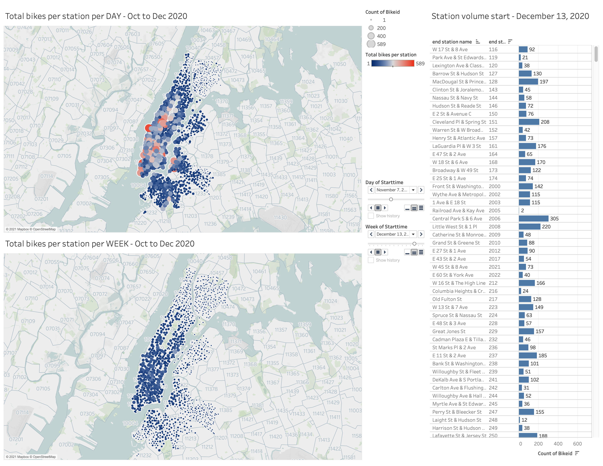
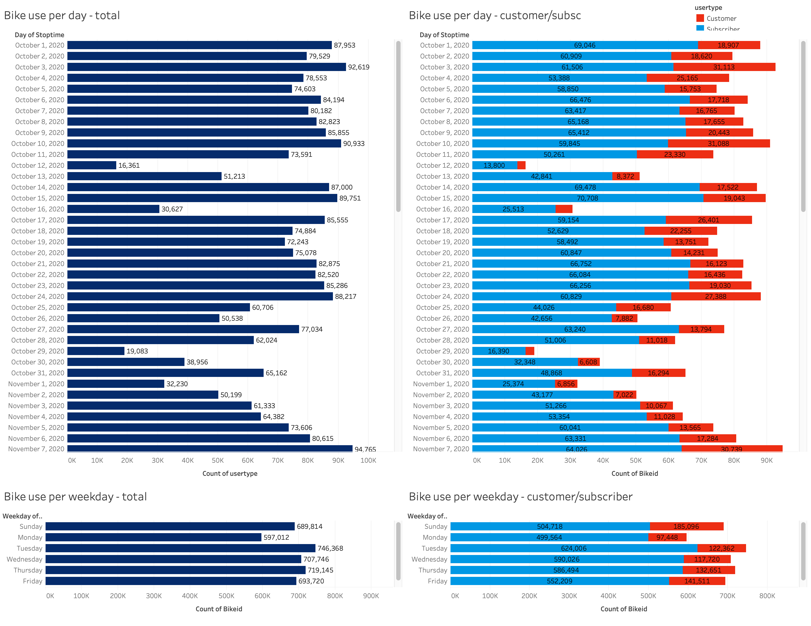
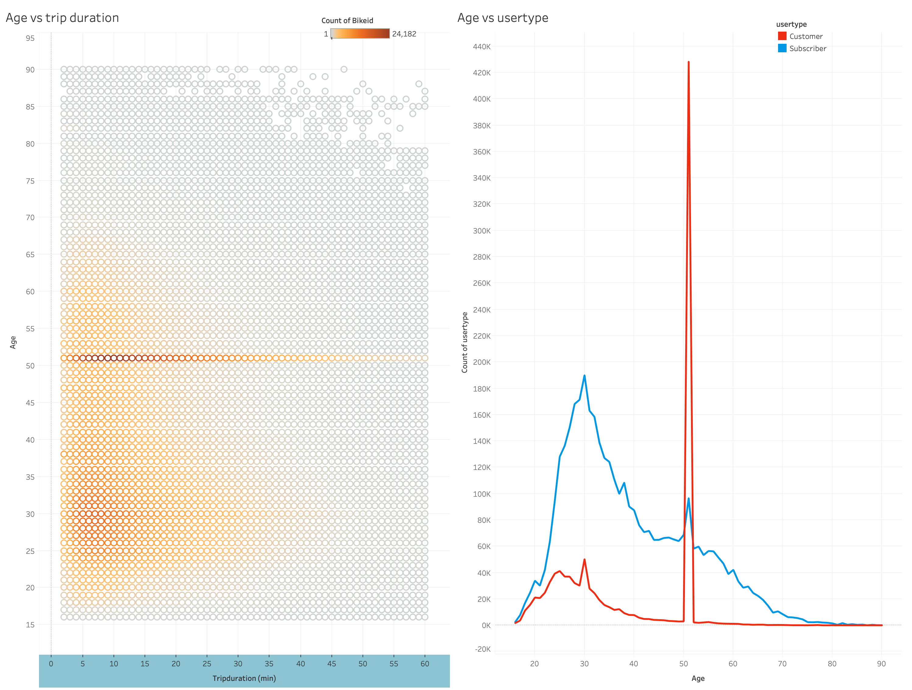
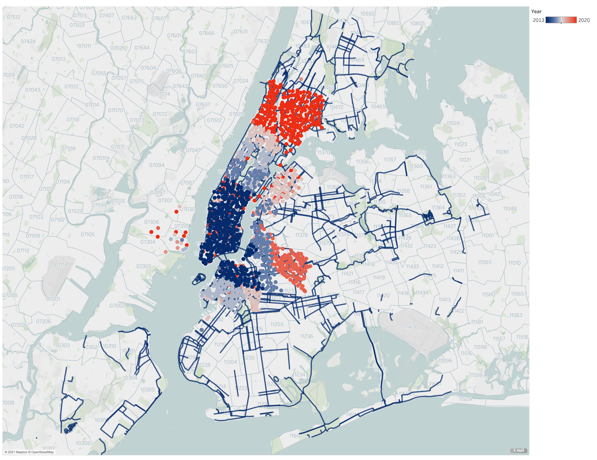
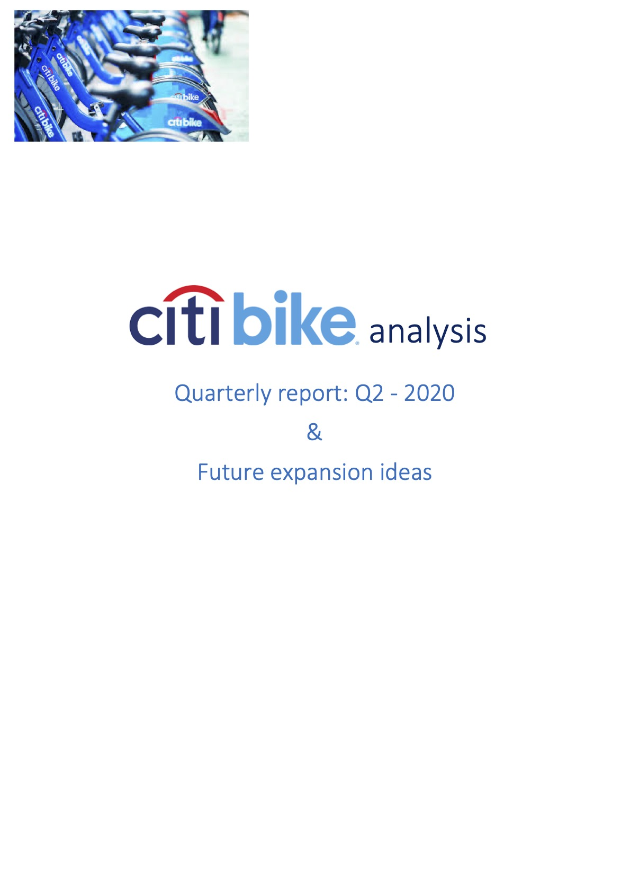
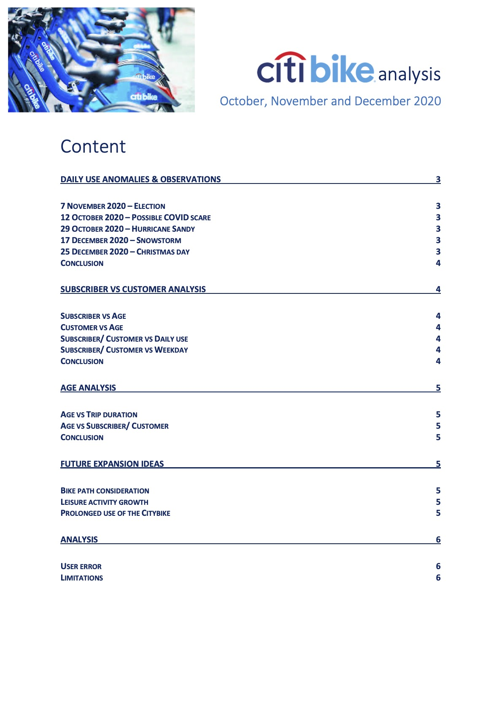
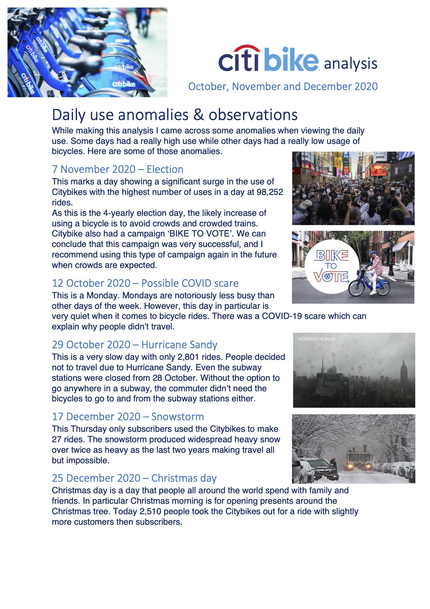
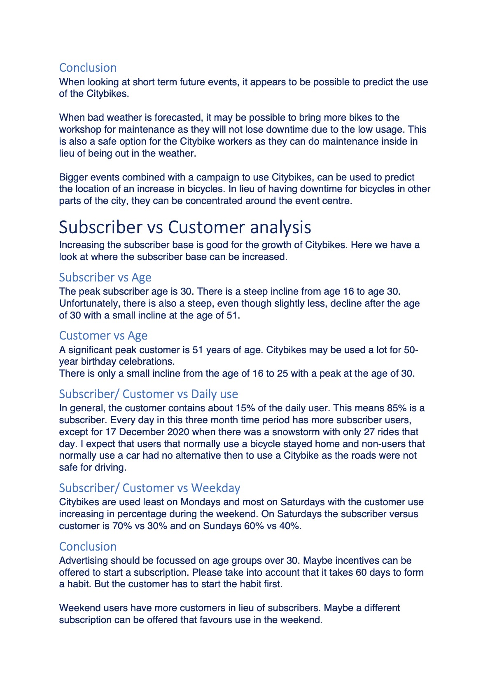
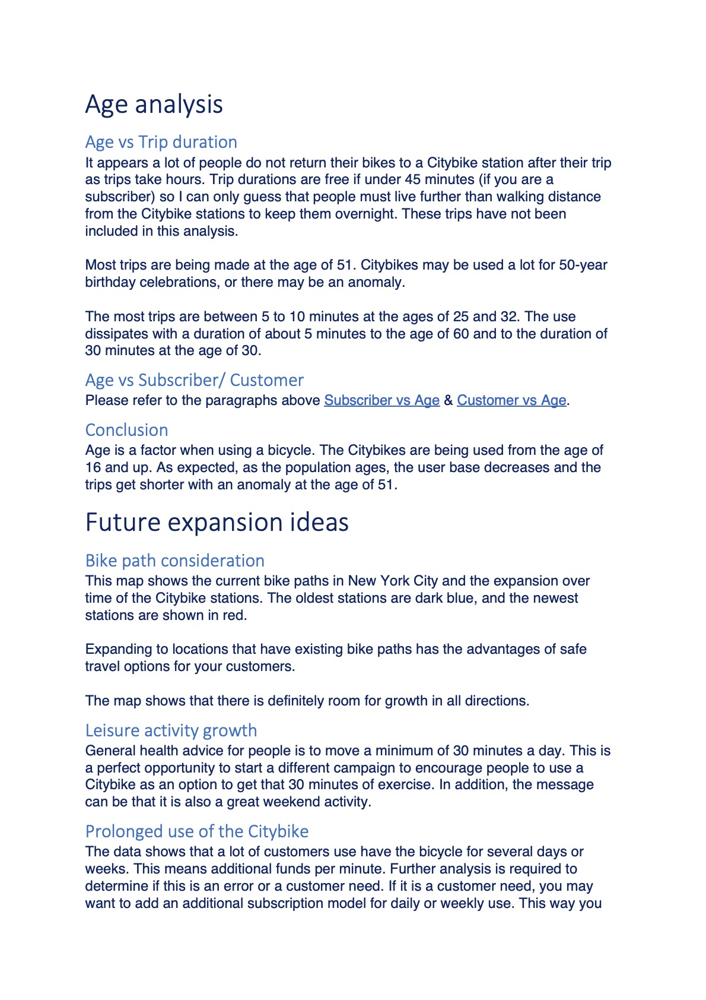
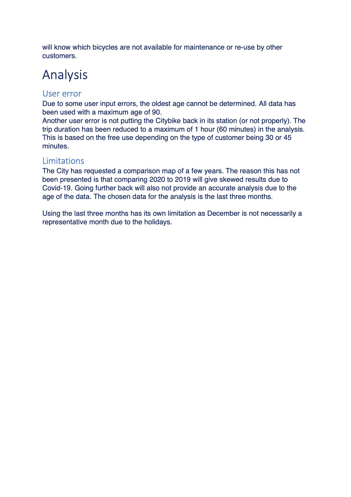

# Tableau
20 Tableau homework - Citybike Analytics

Due to the Github file size restrictions, I was unable to upload the Tableau workbook and data files.

[You can access the workbook on the Tableau public website](https://public.tableau.com/views/20Tableauhomework-CitybikeNewYork/Story?:language=en&:display_count=y&publish=yes&:origin=viz_share_link)

* Analysis and visualisation of Citybike New York from October to December 2020.
* The data was cleaned using Python with Pandas.
* Created several worksheets, dashboards and a story accompanied by an analytical report.

## Here are the screenshots of my story:

#### This page shows the Citybikes volumes at the start locations per day, week or station. In the workbook there is also a page for the end locations.

#### This page shows the daily use of the Citybikes as total number of bikes used and if they are subscribers or other customers.

#### This page shows an analysis of the age of the customer in relation to the trip duration and if they are subscribers or other customers.

#### This page shows the location of existing bicycle paths in realtion to the growth of the Citybike stations per year.

## Here is my report:

